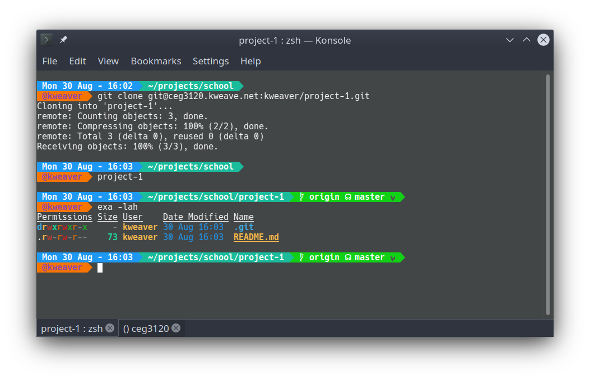
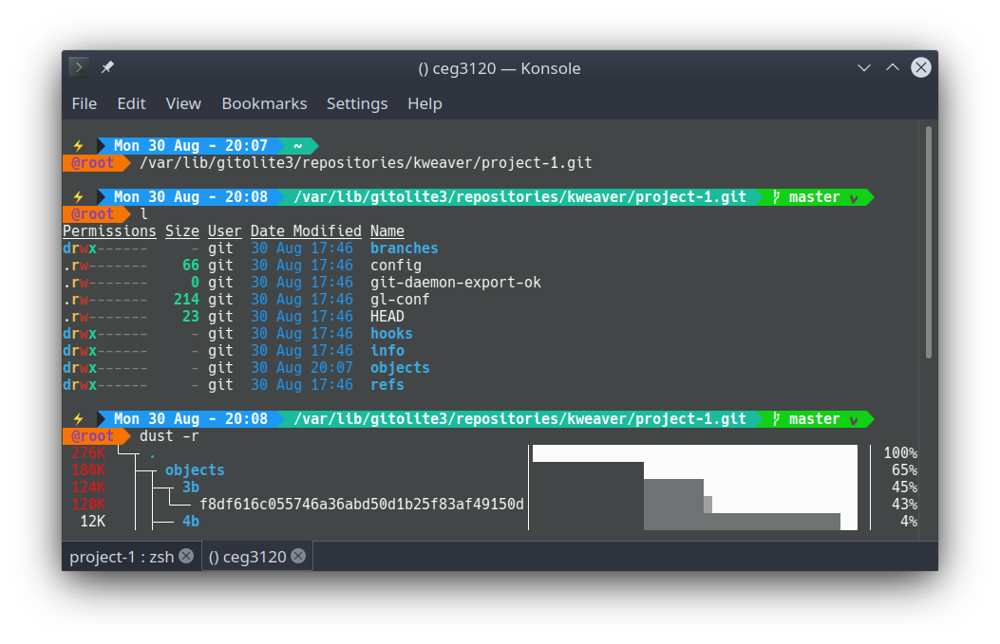

# Project 1

## Server Setup

### Install Software

- (Note: This method of config only works on Debian-based systems)

First, make an accessible copy of your admin user's public SSH key, e.g. at `/tmp/admin.pub`.

Then install gitolite with this environment variable to make sure all the config questions are asked:

> `sudo DEBIAN_PRIORITY=medium apt install gitolite3 -y`

During install, change the username to `git`, leave the repository directory unchanged (`/var/lib/gitolite3/`), and enter the path to the SSH key copy you just made.

Verify the connection works from your client with `ssh git@ceg3120.kweave.net info`

### Configure

On your client, pull the admin config with `git clone git@ceg3120.kweave.net:gitolite-admin`. Changes are made locally, then committed and pushed.

#### Add User

Place a SSH public key file (ending in `.pub`) into `gitolite-admin/keydir/`, given the desired username.

#### Add Repo

Edit the file `gitolite-admin/conf/gitoline.conf`, appending new repos to the file following this pattern:

```
repo REPO_NAME
	RW+		=	USERNAME
	RW		=	USERNAME
	R		=	@all
```

* R, for read only
* RW, to allow fast-forward push of a branch, or create new branch/tag
* RW+, to allow full access -- fast-forward, rewind or delete branches or tags
* \- (the minus sign), to deny access.

## Usage Guide

Below are the basic uses of some `git` commands.

### clone

To clone from this a repo on this server, use `git clone git@ceg3120.kweave.net:USERNAME/REPONAME.git`

### init

You can create a new empty repository in the current directory with `git init`, or at another location with `git init [directory]`. If nonexistent, git will create the folders as necessary.

### add

`git add [files]` will add the files to the content stage for the next commit. The command will accept multiple files, space separated and/or with a glob pattern.

### commit

`git commit -m "[message]"` will create a commit from the current content stage, with a required message to describe what the commit does.

### push

`git push` will send any local changes to all the configured remote repositories.

## Test Repository

A public accessible testing repo is available to clone with `git clone git@ceg3120.kweave.net:testing`

## Screenshots

### Local Cloning



### Remote Repo

Using the [dust](https://github.com/bootandy/dust) tool to see the file sizes, with the above image being the largest file.


