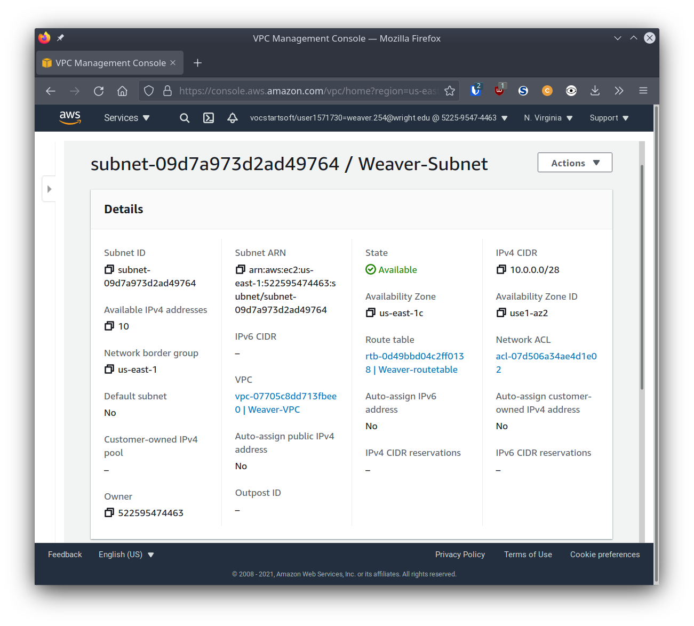
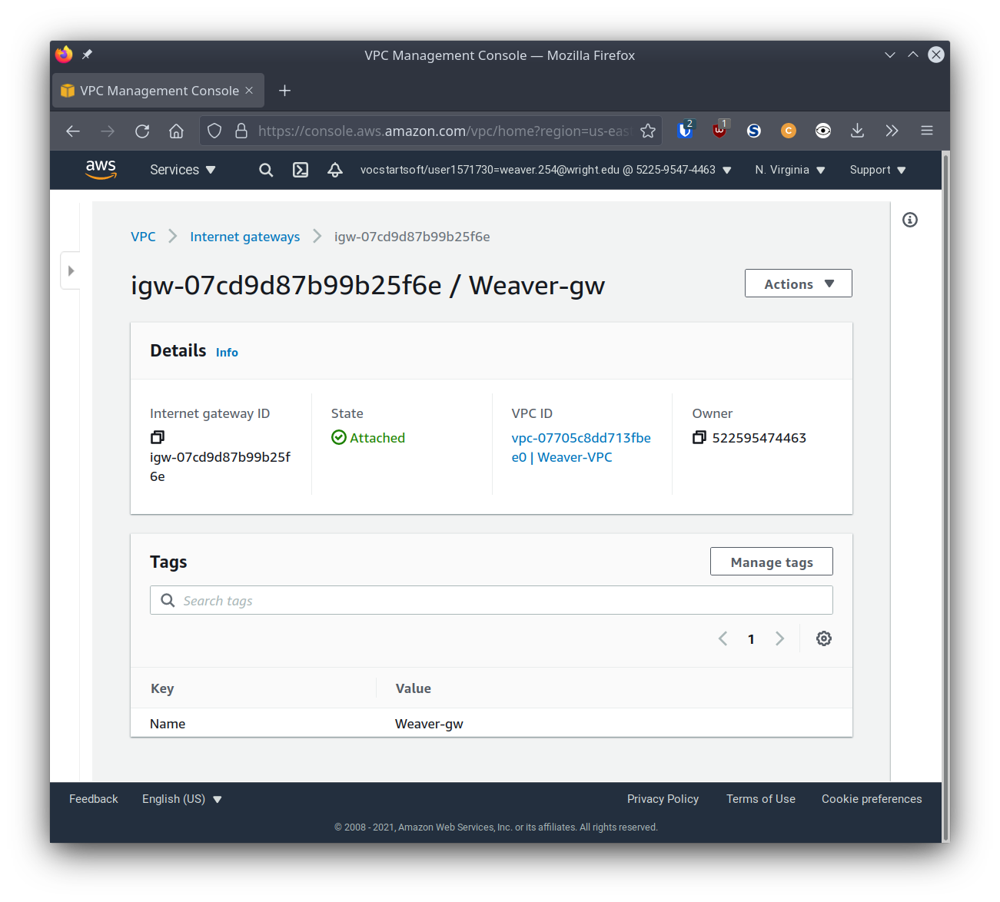

# Project 3

## Part 1 - Build a VPC

For each step below, provide a screenshot that shows the network resource has been created according to specification along with a description of what the resource does (what is its role). You may add whatever additional notes you would like. The screenshot and description of each network component is required. Any other notes you leave behind may make this project more useful in the future. Getting a good screenshot can be done by clicking on the resource and showing configurations in the details menu.

### VPC

A Virtual Private Cloud is an isolated network of resources created with a cloud computing vendor.

### Subnet

A subnet is a defined range of available IP addresses within a VPC.

### Internet Gateway

An Internet gateway controls and directs the traffic coming in and going out from your VPC to the wider Internet.

### Route Table

A route table defines where inbound and outbound network traffic is directed to, and is generally required for an Internet gateway

### Security Group

A security group acts as a firewall for the VPC, specifying what IPs and ports can and cannot connect through your Internet gateway.

## Part 2

1. Create a new instance.
    - Created a new t2.micro instance of AMI
2. Attach the instance to your VPC.
    - In "3. Configure Instance", set the Network to Weaver-VPC.
3. Determine whether a Public IPv4 address will be auto-assigned to the instance.
	- Used the subnet setting of Disable for this step.
4. Attach a volume to your instance.
	- In "4. Add Storage", added a new EBS type Volume.
5. Tag your instance with a "Name".
	- In "5. Add Tags", added new Tag of key "Name" and value "Weaver-Instance".
6. Associate your security group to your instance.
	- In "6. Configure Security Group", chose "Select an existing security group" and selected Weaver-sg group.
7. Reserve an Elastic IP address.
	- Modifying the EIP from Project1:
    	- Added tag of "Name" and Weaver-EIP.
    	- Disassociated EIP from old instance.
    	- Associated EIP to Weaver-instance.
8. Create a screenshot your instance details.

9. ssh in to your instance. Change the hostname.
	- Used `sudo hostnamectl set-hostname Weaver-AMI`.
10. Create a screenshot your ssh connection to your instance.

