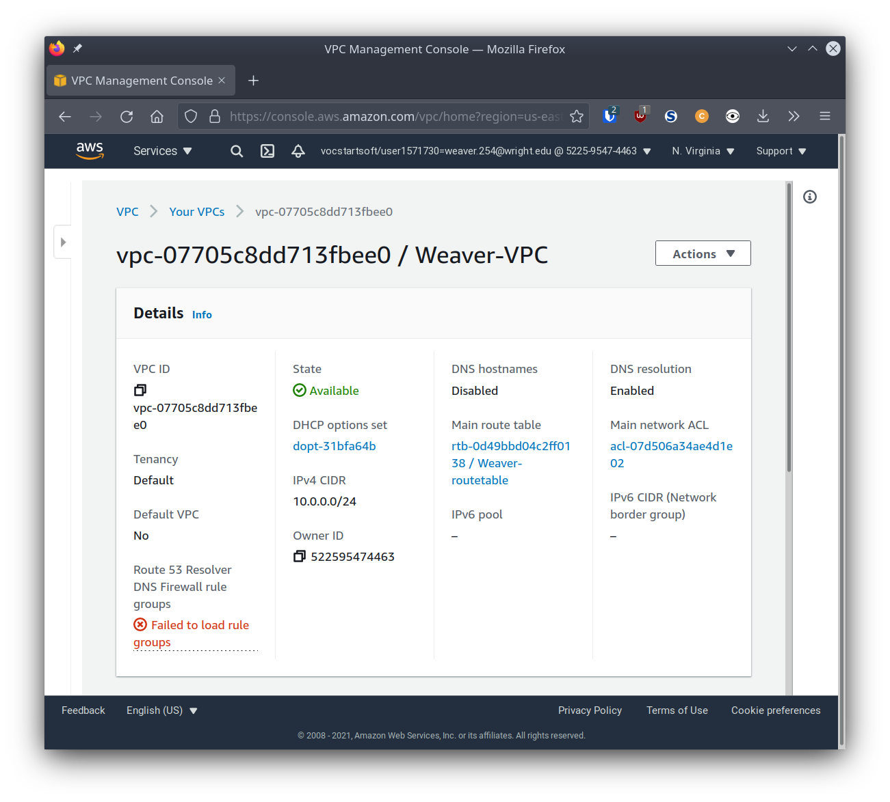

# Project 3

## Part 1 - Build a VPC

For each step below, provide a screenshot that shows the network resource has been created according to specification along with a description of what the resource does (what is its role). You may add whatever additional notes you would like. The screenshot and description of each network component is required. Any other notes you leave behind may make this project more useful in the future. Getting a good screenshot can be done by clicking on the resource and showing configurations in the details menu.

### VPC

A Virtual Private Cloud is an isolated network of resources created with a cloud computing vendor.

### Subnet

A subnet is a defined range of available IP addresses within a VPC.

### Internet Gateway

An Internet gateway controls and directs the traffic coming in and going out from your VPC to the wider Internet.

### Route Table

A route table defines where inbound and outbound network traffic is directed to, and is generally required for an Internet gateway

### Security Group

A security group acts as a firewall for the VPC, specifying what IPs and ports can and cannot connect through your Internet gateway.

