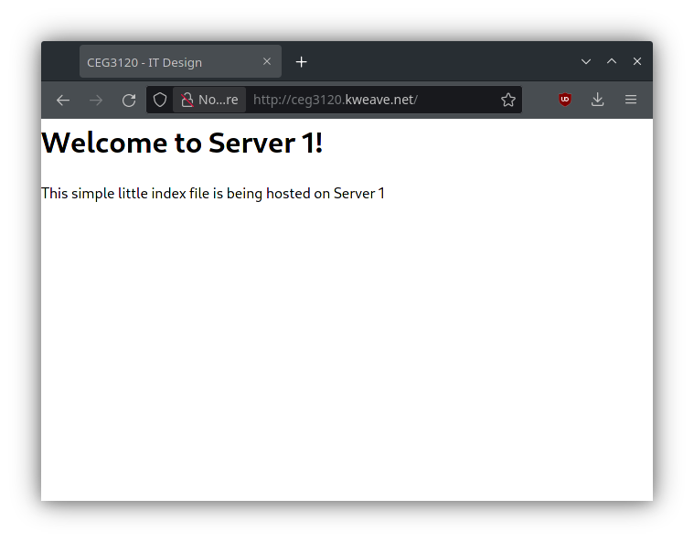

# Project 5

Instances take about 7 minutes to come fully online after CloudFormation creation.

## Objectives

- Modify the CF template to meet updated requirements
- Run a website of choice using nginx or apache2
- Configure the HAProxy load balancer to direct traffic to two backend systems

## Link

http://ceg3120.kweave.net

Note: The haproxy load balancing may be interfered with by fancy Cloudflare DNS/caching services. Along with browser security features that attempt to automatically redirect to HTTPS.

## /etc/hosts

The [common initial setup script](./files/init-script.sh) that runs on all instances will append all 3 private IP address and hostnames to /etc/hosts.

## SSH

- Public load balancer: `ssh ubuntu@ceg3120.kweave.net`
- Private web server 1: `ssh ubuntu@ceg3120.kweave.net -p 2201`
- Private web server 2: `ssh ubuntu@ceg3120.kweave.net -p 2202`
- Installed nftables to configure port forwarding from proxy to web servers, so the web servers are not publicly exposed.
  - [Configuration file](./files/nftables.conf) (/etc/nftables.conf)
  - Reference used: [RHEL7 Security Guide](https://access.redhat.com/documentation/en-us/red_hat_enterprise_linux/7/html/security_guide/sec-configuring_port_forwarding_using_nftables)

## HAProxy

- Install: `apt install haproxy`
- Only config file modified.
- [Configuration changes](./files/haproxy.cfg.append) were appended onto package's default config at /etc/haproxy/haproxy.cfg
- Restart server (after config change): `systemctl restart haproxy.service`
- Resources use: [HAProxy Configuration Manual](https://cbonte.github.io/haproxy-dconv/2.0/configuration.html)

## Web server 1 & 2

- Install: `apt install nginx`
- HTML index files were dropped into /var/www/html/index.html
- No configuration changes made from package defaults.
- Restart server (after config change): `systemctl restart nginx.service`
- No resources used

## Screenshots

### Server 1

### Server 2

